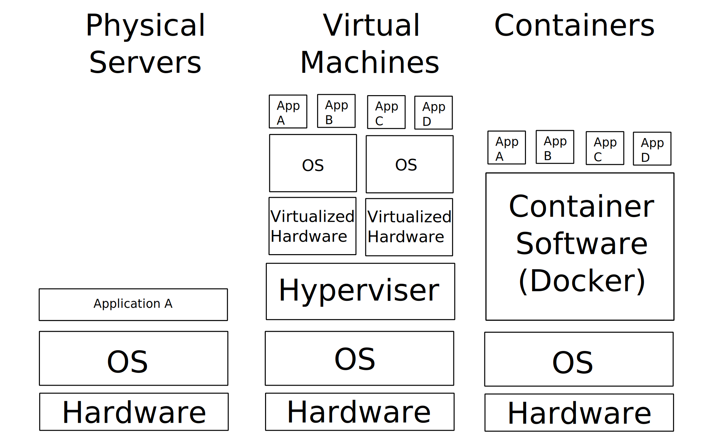

# Overview

This article covers the following topics:
- The difference between a physical server, a VM and containerization
- Docker terminology
- How to use Docker to:
    - Build an image
    - Run a basic container from an image
    - Interact with a running container
    - Connect multiple containers with a Docker network

# What problem does containerization solve?

While it is true that containerization isolates processes, that is not the actual selling point of containers. Isolating processes is a solved problem. Run each application on a separate physical server. Boom, problem solved. It's expensive, and difficult to maintain, but your processes are isolated.

The actual problem that containerization solves is **isolating processes efficiently**.

# Comparing Options to Isolate apps

## Physical Servers

At the end of the day, everything is running on physical hardware. But setting up a physical server for each application is not an efficient way to isolate apps. Setting up a new server is a costly, manual process that can take days or weeks depending on org structure and priority.

- ❌ Hardware can cost hundreds or thousands of dollars
- ❌ Takes a lot of time to acquire/configure a new server (days or weeks)
- ❌ Setting up a new physical server is a very manual process

## Virtual Machines

A VM is a full on operating system running on the virtualized hardware of the physical server. A hypervisor is used to virtualize the physical hardware. Virtual machines have a full on copy of the operating system. Starting up a VM can take minutes.

- ⚠ Can run multiple VM's on a single physical server
- ❌ Each VM requires its own copy of the OS (GBs)
- ⚠ Startup time takes minutes

## Containers

<!--  -->

The concept of containerization leaves some room for interpretation but in short:

> Containers are lightweight packages of your application code together with dependencies such as specific versions of programming language runtimes and libraries required to run your software services. - [cloud.google.com](https://cloud.google.com/learn/what-are-containers)

Containers are a lightweight way of running isolated (ish) processes on a single OS. There are different methods of containerization (see [history of containerization](https://blog.aquasec.com/a-brief-history-of-containers-from-1970s-chroot-to-docker-2016)) but the introduction of Docker in 2013 is when containerization really started to take off.

- ✅ Can run multiple containers on a single OS
- ✅ Containers share the host machines kernel and libraries (read only for Docker) which makes the container itself small (MBs)
- ✅ Startup time takes seconds

### Docker

Docker is a linux based, infrastructure as code containerization tool.

Docker is used to build, share and run containers. Often other tools are used for container orchestration (scaling/restarting/etc).

In practice, I think of Docker as similar to a virtual machine, however the way that containers actually work is completely different.

Docker containers adhere to the [Open Container Initiative](https://opencontainers.org/) (OCI) specification. This means that Docker containers can (usually) be run by other implementations of the OCI spec such as [podman](https://podman.io/) (Pod Manager), [containerd](https://containerd.io/) and more.

### IIS

I would actually say that IIS is somewhat a form of Windows based containerization. Although it doesn't appear to follow an Infrastructure as Code pattern.

# Docker Terminology

**Dockerfile**

The blueprint for building a Docker image. The Dockerfile specifies the starting point for the Docker image, as well as commands to be run when creating the image.

**Image**

A runnable version of a Docker container. This is the result of running `docker build` on a Dockerfile.

**Container**

A running (or stopped) instance of a Docker image. This is the result of running `docker run`

# Using Docker

We will discuss using docker to create an image, run the image as a container, and interact with the running container.

## Creating an image

## Running a container from an image

## Interacting with a running container

# Using Docker (advanced)

## Connecting Docker containers on a network

# Summary
